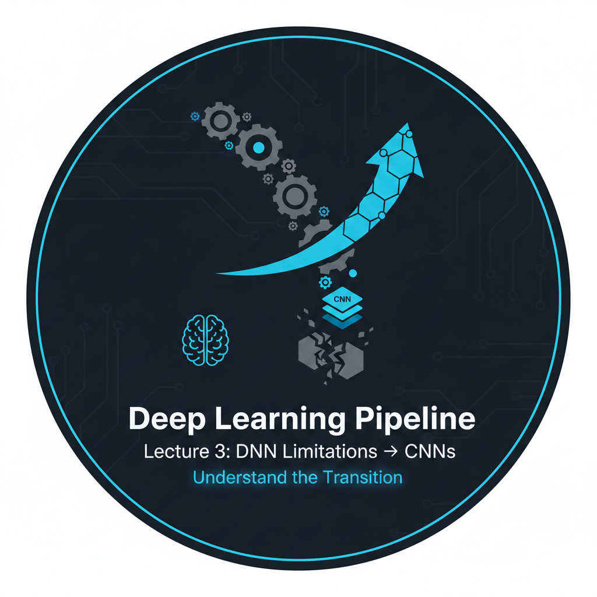

# Deep Learning Pipeline - Lecture 3: DNN Limitations & Transition to CNN Architectures



A complete, production-ready deep learning pipeline demonstrating **DNN limitations** across **3 architectures × 3 datasets (9 models)**. This project **visually illustrates** why Convolutional Neural Networks (CNNs) were invented for computer vision tasks.

## 🎯 Quick Results Preview

| Dataset | Best DNN Accuracy | Key Limitation Demonstrated |
|---------|-------------------|----------------------------|
| MNIST | **~95-98%** | Works well on simple binarized data |
| Fashion MNIST | **~85-90%** | Struggles with more complex shapes |
| CIFAR-10 | **~45-55%** | **Severe failure** - loses spatial & color info |

> *These results clearly show why CNNs are necessary for real-world vision tasks!*

## 🔍 Key Findings from This Pipeline

1. **📊 Parameter Inefficiency**: Deep DNNs use 3-4× more parameters than simple DNNs for minimal accuracy gain
2. **🧩 Spatial Amnesia**: Flattening destroys crucial positional relationships
3. **🔄 Translation Vulnerability**: Same object in different positions = completely different input
4. **🎨 Color Blindness**: RGB→grayscale loses discriminative color features  
5. **📈 Hierarchical Learning Gap**: DNNs can't build complex features from simple patterns

## 🎓 Learning Objectives

After completing this pipeline, you will understand:
- ✓ **How DNNs process image data** (and why flattening is problematic)
- ✓ **Why parameter sharing** is crucial for image processing
- ✓ **The importance of translation invariance** in vision tasks
- ✓ **How hierarchical feature learning** works in deep networks
- ✓ **Practical differences** between MNIST, Fashion MNIST, and CIFAR-10
- ✓ **When to transition from DNNs to CNNs** for real-world applications

## 📋 Prerequisites

- **Python 3.8+**
- **4GB+ RAM** (8GB recommended for full pipeline)
- **2GB+ disk space** for datasets
- Basic understanding of neural networks

## ⏱️ Time Estimates

| Task | Approximate Time |
|------|------------------|
| Download all datasets | 5-10 minutes |
| Train all 9 models | 30-60 minutes (CPU) |
| Evaluation & visualization | 2-3 minutes |
| UI launch | Instant |

## 📊 Experiment Matrix (3×3 = 9 Models)

| Architecture \ Dataset | MNIST | Fashion MNIST | CIFAR-10 |
|------------------------|-------|---------------|----------|
| **Simple DNN** (1 hidden) | Model 1 | Model 2 | Model 3 |
| **Medium DNN** (2 hidden) | Model 4 | Model 5 | Model 6 |
| **Deep DNN** (3 hidden) | Model 7 | Model 8 | Model 9 |

---

## 🚀 Multiple Ways to Run the Pipeline

### Option 1: Using CLI Commands (Recommended)
```bash
# Complete pipeline (download → train → evaluate → visualize)
dl-pipeline --run-mode all

# Individual components
dl-download --datasets mnist fashion cifar10
dl-train --dataset mnist --architecture deep_dnn
dl-evaluate
dl-ui --share-ui
```

### Option 2: Direct Python Script Execution
```bash
# Complete pipeline
python scripts/run_pipeline.py --run-mode all

# Specific modes
python scripts/run_pipeline.py --run-mode data        # Download data only
python scripts/run_pipeline.py --run-mode train       # Train models only
python scripts/run_pipeline.py --run-mode evaluate    # Evaluate only
python scripts/run_pipeline.py --run-mode ui          # Launch UI only
```

### Option 3: Legacy Scripts (For Backward Compatibility)
```bash
# Download data (legacy)
python scripts/download_data.py --datasets mnist

# Train model (legacy) 
python scripts/train_model.py --dataset mnist --architecture simple_dnn
```

### Option 4: Python Module Execution
```bash
# Run as a Python module
python -m scripts.run_pipeline --run-mode all

# With debug logging
python -m scripts.run_pipeline --run-mode train --log-level DEBUG
```

---

## 🚀 Installation & Quick Start

### Method 1: Quick Start (No Installation Required)
```bash
# Clone or download the project
# cd into the project directory
cd deep-learning-pipeline-lecture3

# Install minimal dependencies
pip install --user numpy pandas matplotlib scikit-learn tqdm pillow

# Run directly with Python
python scripts/run_pipeline.py --run-mode all
```

### Method 2: Full CLI Setup
```bash
# Install all dependencies
pip install --user numpy pandas matplotlib scikit-learn tqdm pillow gradio pyyaml

# Install CLI tools
chmod +x install_cli_simple.sh
./install_cli_simple.sh

# Add to PATH
echo 'export PATH="$HOME/.local/bin:$PATH"' >> ~/.bashrc
source ~/.bashrc

# Now use CLI commands
dl-pipeline --run-mode all
```

### Method 3: Virtual Environment (Clean Isolation)
```bash
# Create virtual environment
python -m venv venv
source venv/bin/activate

# Install all dependencies
pip install -r requirements.txt

# Run with any method
python scripts/run_pipeline.py --run-mode all
# OR
dl-pipeline --run-mode all
```

## 📝 Usage Examples - All Methods

### Complete Pipeline (4 Ways)
```bash
# Method 1: CLI command
dl-pipeline --run-mode all

# Method 2: Direct Python script
python scripts/run_pipeline.py --run-mode all

# Method 3: Python module
python -m scripts.run_pipeline --run-mode all

# Method 4: Legacy style
python scripts/run_pipeline.py --config config/config.yaml --run-mode all
```

### Download Datasets (3 Ways)
```bash
# CLI command
dl-download --datasets mnist fashion cifar10

# Direct script
python scripts/run_pipeline.py --run-mode data --datasets mnist fashion cifar10

# Legacy script
python scripts/download_data.py --datasets mnist fashion cifar10
```

### Train Specific Model (3 Ways)
```bash
# CLI command
dl-train --dataset mnist --architecture deep_dnn --epochs 20

# Direct script (train only mode)
python scripts/run_pipeline.py --run-mode train --datasets mnist --architectures deep_dnn

# Legacy script
python scripts/train_model.py --dataset mnist --architecture deep_dnn
```

### Launch UI (3 Ways)
```bash
# CLI command
dl-ui --share-ui

# Direct script
python scripts/run_pipeline.py --run-mode ui --share-ui

# Direct UI launch
python src/inference/ui.py
```

## 🎯 Quick Reference - All Execution Methods

| Task | CLI Command | Python Script | Module | Legacy |
|------|-------------|---------------|--------|--------|
| **Full pipeline** | `dl-pipeline --run-mode all` | `python scripts/run_pipeline.py --run-mode all` | `python -m scripts.run_pipeline --run-mode all` | N/A |
| **Download data** | `dl-download --datasets mnist` | `python scripts/run_pipeline.py --run-mode data` | `python -m scripts.run_pipeline --run-mode data` | `python scripts/download_data.py` |
| **Train model** | `dl-train --dataset mnist --arch deep_dnn` | `python scripts/run_pipeline.py --run-mode train` | `python -m scripts.run_pipeline --run-mode train` | `python scripts/train_model.py` |
| **Evaluate** | `dl-evaluate` | `python scripts/run_pipeline.py --run-mode evaluate` | `python -m scripts.run_pipeline --run-mode evaluate` | N/A |
| **Launch UI** | `dl-ui --share-ui` | `python scripts/run_pipeline.py --run-mode ui` | `python -m scripts.run_pipeline --run-mode ui` | N/A |

## 🆘 Troubleshooting - Choose Your Method

### If CLI commands don't work:
```bash
# Use direct Python script instead
python scripts/run_pipeline.py --run-mode all
```

### If virtual environment issues:
```bash
# Skip virtual env, use system Python
python scripts/run_pipeline.py --run-mode data
```

### If Gradio not installed:
```bash
# Skip UI, run evaluation only
python scripts/run_pipeline.py --run-mode evaluate
```

### Quick test with minimal setup:
```bash
# Just download and look at data
python scripts/run_pipeline.py --run-mode data --datasets mnist

# Check what models exist
ls dl_pipeline_lecture3/models/ 2>/dev/null || echo "No models yet"
```

## 🎬 Getting Started - Pick Your Path

### **For Beginners** (Easiest):
```bash
# Just download and look at the data first
python scripts/run_pipeline.py --run-mode data
```

### **For Experienced Users** (Full experience):
```bash
# Install CLI tools once
./install_cli_simple.sh

# Then use convenient commands
dl-pipeline --run-mode all
```

### **For Developers** (Flexible):
```bash
# Mix and match methods
python scripts/run_pipeline.py --run-mode data
dl-train --dataset mnist --architecture simple_dnn
python scripts/run_pipeline.py --run-mode evaluate
dl-ui
```

### **For Quick Testing**:
```bash
# Test one model on one dataset
python scripts/run_pipeline.py --run-mode train --datasets mnist --architectures simple_dnn
```

**No matter which method you choose, you'll experience the same educational journey showing why CNNs are needed!** 🚀

---

## 📁 Project Structure

```
deep-learning-pipeline-lecture3/
├── config/                           # YAML configuration files
│   ├── config.yaml                   # Main pipeline configuration
│   └── experiments/
│       └── lecture3_experiment.yaml  # 3×3 experiment configuration
├── src/                              # Modular source code
│   ├── data/                         # Data loading & preprocessing
│   ├── models/                       # Neural network implementations
│   ├── training/                     # Training orchestration
│   ├── evaluation/                   # Metrics & analysis
│   ├── inference/                    # Prediction & UI
│   └── utils/                        # Configuration, logging, visualization
├── scripts/                          # CLI entry points
│   ├── run_pipeline.py               # Complete pipeline runner
│   ├── cli_tools.py                  # All CLI commands
│   └── (symlinked to dl-* commands)  # Convenience CLI
├── notebooks/
│   └── lecture3_complete.ipynb       # Complete Jupyter notebook
├── tests/                            # Unit tests
├── requirements.txt                  # Python dependencies
├── assets/                           # Images and diagrams
├── docs/                             # Documentation
└── README.md                         # This file
```

## 🔧 Features

### 📥 **Data Loading**
- Direct URL downloads with **retry logic** and **progress bars**
- **No library dependencies** - loads data directly from source URLs
- Local caching to avoid re-downloads
- Support for MNIST, Fashion MNIST, and CIFAR-10 with **multiple mirrors**

### 🏗️ **Model Implementation**
- **First principles implementation** - no deep learning frameworks
- 3 different DNN architectures (simple, medium, deep)
- **L2 regularization** and smart weight initialization
- **Pure mathematical operations** - easy to understand and debug

### 📊 **Training & Evaluation**
- **3×3 experiment matrix** (9 models total)
- **Comprehensive training visualization** (loss, accuracy, timing)
- **Comparative analysis** of all models
- **Automatic insight generation** about DNN limitations

### 🎨 **Interactive UI** (Gradio)
- **Real-time predictions** on uploaded/drawn images
- **Model comparison** across all datasets
- **Probability visualization** with bar charts
- **Sample images** for quick testing

### ⚙️ **Pipeline Design**
- **YAML configuration** for easy experimentation
- **Modular architecture** with clear separation of concerns
- **Comprehensive logging** with configurable levels
- **Professional CLI interface** with 5 commands
- **Unit tests** for core components

## 📝 Advanced Usage

### Custom Experiments
```bash
# Create custom YAML config
cp config/experiments/lecture3_experiment.yaml config/custom_experiment.yaml
# Edit the YAML file with your settings

# Run with custom config
dl-pipeline --config config/custom_experiment.yaml --run-mode all
```

### Detailed Logging
```bash
# Debug level logging
dl-pipeline --run-mode train --log-level DEBUG

# Save logs to file
dl-pipeline --run-mode all 2>&1 | tee pipeline.log
```

### Partial Pipeline Execution
```bash
# Only train and evaluate (skip download if data exists)
dl-pipeline --run-mode train_evaluate

# Only evaluate existing models
dl-pipeline --run-mode evaluate

# Train with specific hyperparameters
dl-train --dataset cifar10 --architecture deep_dnn --epochs 100 --learning-rate 0.001
```

## 🎨 Interactive UI Features

The Gradio UI provides:
- **📱 Dataset selection** (MNIST, Fashion MNIST, CIFAR-10)
- **🖼️ Multiple input methods**: Upload, draw, or use samples
- **⚡ Real-time predictions** with confidence scores
- **📊 Model comparison** across all trained models
- **📈 Visual probability distribution** across classes
- **🎯 Side-by-side architecture comparison**
- **💾 Export results** as CSV or images

### Launching UI with Options
```bash
# Share publicly (valid for 72 hours)
dl-ui --share-ui

# Run on specific port
dl-ui --server-port 8080

# Launch quietly (no browser auto-open)
dl-ui --quiet
```

## 📊 Performance Analysis

After running the pipeline, you'll get:
1. **Accuracy comparison** across all 9 models
2. **Training time analysis** per architecture
3. **Parameter efficiency** metrics
4. **Confusion matrices** for error analysis
5. **Sample predictions** with visualization

## 🧪 Testing & Development

```bash
# Run all tests
python -m pytest tests/

# Run specific test module
python -m pytest tests/test_models.py -v

# Run with coverage report
python -m pytest tests/ --cov=src --cov-report=html

# Test individual component
python -m pytest tests/test_data_loader.py::TestDataLoader -xvs

# Development mode (reload on changes)
python scripts/run_pipeline.py --run-mode train --reload
```

## 📚 Educational Value

This pipeline demonstrates **core deep learning concepts**:

1. **🔬 From First Principles**: No black-box frameworks - understand every operation
2. **📈 Progressive Complexity**: Simple → Medium → Deep architectures
3. **🎯 Dataset Complexity**: MNIST → Fashion MNIST → CIFAR-10
4. **📊 Limitation Analysis**: Clear visualization of where DNNs fail
5. **🏗️ Pipeline Design**: Production-ready ML system architecture
6. **🔄 Iterative Learning**: Each experiment builds on previous insights

## 🔮 Looking Ahead: Lecture 4

This pipeline **clearly demonstrates** why we need CNNs. In Lecture 4, we'll implement:

- **🧠 Convolutional layers** with parameter sharing
- **📉 Pooling layers** for translation invariance  
- **🏗️ Hierarchical feature learning** (edges → patterns → objects)
- **🌈 RGB processing** through multi-channel convolution
- **📊 CNN vs DNN comparison** on the same datasets
- **⚡ Performance improvements** with 10-100× fewer parameters

## 👥 Contributor Guidelines

1. **📝 Follow existing code structure** and naming conventions
2. **🧪 Add tests** for new features
3. **⚙️ Update configuration YAMLs** for new components
4. **📖 Document new CLI commands** in README
5. **🎓 Keep educational focus** - explain "why" not just "how"
6. **✅ Maintain backward compatibility** for existing experiments

## 📄 License

MIT License - see [LICENSE](LICENSE) file for details.

## 🙏 Acknowledgments

- **Datasets**: Yann LeCun (MNIST), Fashion MNIST researchers, CIFAR-10 creators
- **Inspiration**: CS231n, fast.ai, and ML engineering best practices
- **Focus**: Understanding deep learning from first principles

## 📚 References & Further Reading

1. LeCun, Y., Bottou, L., Bengio, Y., & Haffner, P. (1998). *Gradient-based learning applied to document recognition*
2. Krizhevsky, A., Sutskever, I., & Hinton, G. E. (2012). *ImageNet classification with deep convolutional neural networks*
3. [CS231n: Convolutional Neural Networks for Visual Recognition](http://cs231n.stanford.edu/)
4. [Deep Learning Book](https://www.deeplearningbook.org/) - Chapter 9: Convolutional Networks


---

## 🎬 Ready to See Why CNNs Were Invented?

Watch DNNs struggle with complex data in real-time!

```bash
# Run the complete pipeline
dl-pipeline --run-mode all

# Or just launch the UI to test existing models
dl-ui --share-ui

# Or experience it step by step
python scripts/run_pipeline.py --run-mode data
python scripts/run_pipeline.py --run-mode train
python scripts/run_pipeline.py --run-mode evaluate
python scripts/run_pipeline.py --run-mode ui
```

**Experience the limitations of DNNs firsthand → Understand why CNNs revolutionized computer vision → Prepare for Lecture 4's CNN implementation!**

---

*[Back to top](#deep-learning-pipeline---lecture-3-dnn-limitations--transition-to-cnn-architectures)*